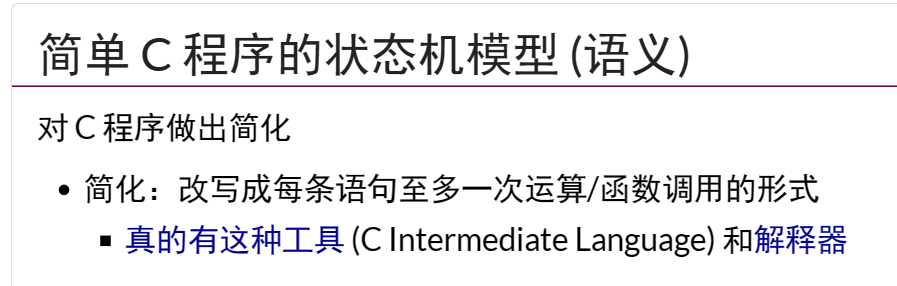

exit qemu
ctrl+A  and then press X 

debug in vscode:
https://zhuanlan.zhihu.com/p/501901665

优雅的调试在vscode上完美调试xv6完结/

https://sanbuphy.github.io/p/%E4%BC%98%E9%9B%85%E7%9A%84%E8%B0%83%E8%AF%95%E5%9C%A8vscode%E4%B8%8A%E5%AE%8C%E7%BE%8E%E8%B0%83%E8%AF%95xv6%E5%AE%8C%E7%BB%93/


prep env for debug xv6-os
https://zhuanlan.zhihu.com/p/509296983
or this : 

## gen compile_commands.json
https://github.com/rizsotto/Bear
```
<!-- stop vpn if need: -->
export https_proxy=
export http_proxy=
make clean && bear -- make qemu
```


## how to debug a user prog? such as ls.c?
break point grey in vscode ?
need symbol table ?(code ? )

## compiler

CIL:
gcc -fdump-tree-gimple -o output_fi
le ./hello.c


xv6 is a re-implementation of Dennis Ritchie's and Ken Thompson's Unix
Version 6 (v6).  xv6 loosely follows the structure and style of v6,
but is implemented for a modern RISC-V multiprocessor using ANSI C.


ACKNOWLEDGMENTS

xv6 is inspired by John Lions's Commentary on UNIX 6th Edition (Peer
to Peer Communications; ISBN: 1-57398-013-7; 1st edition (June 14,
2000)).  See also https://pdos.csail.mit.edu/6.1810/, which provides
pointers to on-line resources for v6.

The following people have made contributions: Russ Cox (context switching,
locking), Cliff Frey (MP), Xiao Yu (MP), Nickolai Zeldovich, and Austin
Clements.

We are also grateful for the bug reports and patches contributed by
Takahiro Aoyagi, Silas Boyd-Wickizer, Anton Burtsev, carlclone, Ian
Chen, Dan Cross, Cody Cutler, Mike CAT, Tej Chajed, Asami Doi,
eyalz800, Nelson Elhage, Saar Ettinger, Alice Ferrazzi, Nathaniel
Filardo, flespark, Peter Froehlich, Yakir Goaron, Shivam Handa, Matt
Harvey, Bryan Henry, jaichenhengjie, Jim Huang, Matúš Jókay, John
Jolly, Alexander Kapshuk, Anders Kaseorg, kehao95, Wolfgang Keller,
Jungwoo Kim, Jonathan Kimmitt, Eddie Kohler, Vadim Kolontsov, Austin
Liew, l0stman, Pavan Maddamsetti, Imbar Marinescu, Yandong Mao, Matan
Shabtay, Hitoshi Mitake, Carmi Merimovich, Mark Morrissey, mtasm, Joel
Nider, Hayato Ohhashi, OptimisticSide, Harry Porter, Greg Price, Jude
Rich, segfault, Ayan Shafqat, Eldar Sehayek, Yongming Shen, Fumiya
Shigemitsu, Cam Tenny, tyfkda, Warren Toomey, Stephen Tu, Rafael Ubal,
Amane Uehara, Pablo Ventura, Xi Wang, WaheedHafez, Keiichi Watanabe,
Nicolas Wolovick, wxdao, Grant Wu, Jindong Zhang, Icenowy Zheng,
ZhUyU1997, and Zou Chang Wei.


The code in the files that constitute xv6 is
Copyright 2006-2022 Frans Kaashoek, Robert Morris, and Russ Cox.

ERROR REPORTS

Please send errors and suggestions to Frans Kaashoek and Robert Morris
(kaashoek,rtm@mit.edu).  The main purpose of xv6 is as a teaching
operating system for MIT's 6.1810, so we are more interested in
simplifications and clarifications than new features.

BUILDING AND RUNNING XV6

You will need a RISC-V "newlib" tool chain from
https://github.com/riscv/riscv-gnu-toolchain, and qemu compiled for
riscv64-softmmu.  Once they are installed, and in your shell
search path, you can run "make qemu".
